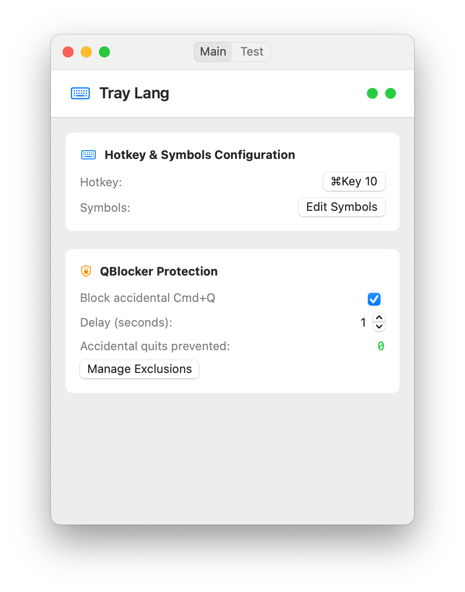

[](https://github.com/s00d/tray-lang)
[](https://github.com/s00d/tray-lang)
[](https://github.com/s00d/tray-lang/releases)
[](https://github.com/s00d/tray-lang/releases)
[](https://github.com/s00d/tray-lang/issues)
[](https://github.com/s00d/tray-lang/stargazers)
[](https://www.donationalerts.com/r/s00d88)

<div align="center">
  
</div>

# Tray Lang

A macOS app that transforms text between keyboard layouts and prevents accidental app quits.



## What it does

**Text Transformation**: Select any text, press a hotkey, and it transforms between Russian/English layouts while switching your keyboard layout.

**Hotkey Blocker**: Prevents accidental Cmd+Q quits and Cmd+W window closes. Hold Cmd+Q for 1-5 seconds to actually quit an app, or hold Cmd+W to close windows. Both protections can be enabled independently.

## Quick Start

1. **Download & Run**: Build from source or download the app
2. **Grant Permissions**: Allow accessibility access when prompted
3. **Configure Hotkey**: Set your preferred key combination
4. **Use**: Select text → press hotkey → text transforms

## Features

### Text Transformation
- Transform text between Russian ↔ English layouts
- Customizable character mappings
- Automatic keyboard layout switching
- Works in any application

### Hotkey Blocker Protection
- **Cmd+Q Protection**: Hold Cmd+Q for 1-5 seconds to quit apps
- **Cmd+W Protection**: Hold Cmd+W for 1-5 seconds to close windows
- Single press shows notification, prevents action
- Exclude specific apps from protection
- Track prevented accidental quits and closes separately
- Independent enable/disable for each protection

### Convenience
- System tray access with modern menu design
- Auto-launch with system
- Customizable hotkeys
- Visual feedback with HUD notifications
- Native macOS appearance (light/dark theme support)

## Configuration

### Hotkey Setup
1. Open tray menu → "Hotkey Editor"
2. Press "Start capture" and your desired keys
3. Press "Confirm" to save

### Hotkey Blocker Settings
- **Cmd+Q Protection**: Enable/disable quit protection
- **Cmd+W Protection**: Enable/disable window close protection
- **Delay**: Set hold time (1-5 seconds)
- **Exclusions**: Manage apps that bypass protection

### Character Mappings
- Edit via tray menu → "Symbols Editor"
- Add custom character mappings
- Use ready-made language templates

## Requirements

- macOS 14.0+
- Accessibility permissions (for text manipulation)

## Installation

### From Source
```bash
git clone <repository>
cd tray-lang
make build
```

### Signing (if needed)
```bash
chmod +x /Applications/tray-lang.app
xattr -cr /Applications/tray-lang.app
codesign --force --deep --sign - /Applications/tray-lang.app
```

## Troubleshooting

**Hotkey not working?**
- Check accessibility permissions
- Try different key combination

**Hotkey Blocker not working?**
- Ensure Cmd+Q and/or Cmd+W protection is enabled in main window
- Check accessibility permissions
- Verify app isn't in exclusion list

**Text not transforming?**
- Make sure text is selected
- Check character mappings
- Verify permissions

## Architecture

Built with SwiftUI and AppKit:
- `HotkeyBlockerManager`: Cmd+Q and Cmd+W protection
- `ExclusionManager`: App exclusion handling
- `HotKeyManager`: Global hotkey management
- `TextTransformer`: Layout conversion logic

## License

© 2025 All rights reserved

## Developer

Developed by s00d
