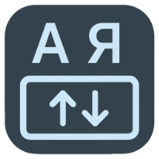
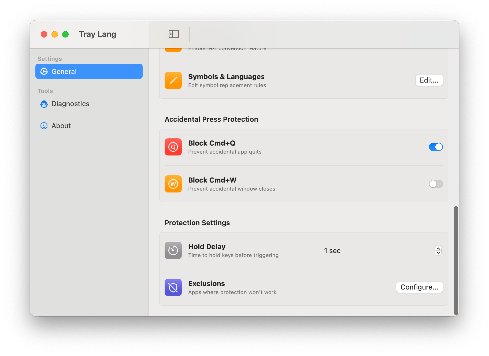
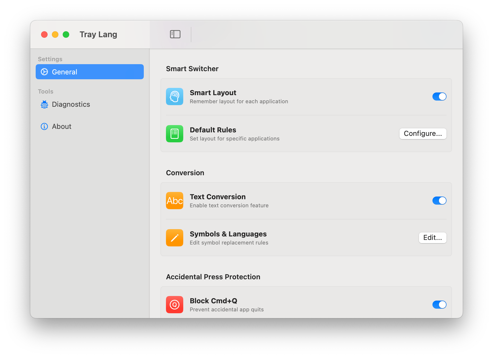
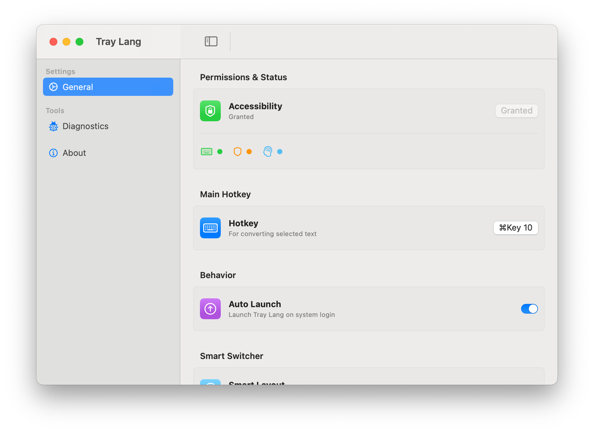

[](https://github.com/s00d/tray-lang)
[](https://github.com/s00d/tray-lang)
[](https://github.com/s00d/tray-lang/releases)
[](https://github.com/s00d/tray-lang/releases)
[](https://github.com/s00d/tray-lang/issues)
[](https://github.com/s00d/tray-lang/stargazers)
[](https://www.donationalerts.com/r/s00d88)

<div align="center">
  
</div>

# Tray Lang

A powerful macOS application that transforms text between keyboard layouts, prevents accidental app quits, and intelligently manages keyboard layouts per application.





## What it does

**Text Transformation**: Select any text, press a hotkey, and it transforms between Russian/English layouts while automatically switching your keyboard layout.

**Smart Layout Switching**: Automatically remembers and switches keyboard layouts for each application. Set default rules for specific apps or let the app learn your preferences.

**Hotkey Blocker**: Prevents accidental Cmd+Q quits and Cmd+W window closes. Hold Cmd+Q for 1-5 seconds to actually quit an app, or hold Cmd+W to close windows. Both protections can be enabled independently.

## Quick Start

1. **Download & Run**: Build from source or download the app
2. **Grant Permissions**: Allow accessibility access when prompted
3. **Configure Hotkey**: Set your preferred key combination in Settings
4. **Use**: Select text → press hotkey → text transforms
5. **Enable Smart Layout**: Toggle "Smart Layout" to automatically switch layouts per app

## Features

### Text Transformation
- Transform text between Russian ↔ English layouts
- Customizable character mappings
- Automatic keyboard layout switching
- Works in any application
- Reliable clipboard-based text processing

### Smart Layout Manager
- **Automatic Learning**: Remembers the last used keyboard layout for each application
- **Default Rules**: Set permanent layout rules for specific applications with highest priority
- **Remembered Layouts**: View and manage automatically saved layouts
- **Pin to Rules**: Convert remembered layouts to permanent default rules with one click
- **Priority System**: Default rules always take precedence over remembered layouts
- **Visual Management**: Modern UI with app icons and clear organization

### Hotkey Blocker Protection
- **Cmd+Q Protection**: Hold Cmd+Q for 1-5 seconds to quit apps
- **Cmd+W Protection**: Hold Cmd+W for 1-5 seconds to close windows
- Single press shows notification, prevents action
- Exclude specific apps from protection
- Track prevented accidental quits and closes separately
- Independent enable/disable for each protection
- Configurable hold delay (1-5 seconds)

### Modern User Interface
- **NavigationSplitView**: Clean, native macOS settings interface
- **System Tray Menu**: Native NSMenu with dynamic status updates
- **Status Indicators**: Real-time visual feedback for all features
- **Organized Settings**: Categorized settings in General, Diagnostics, and About sections
- **Modal Windows**: Modern sheet presentations for configuration
- **App Icons**: Visual app identification in all lists

### Convenience
- System tray access with native menu design
- Auto-launch with system
- Customizable hotkeys
- Visual feedback with HUD notifications
- Native macOS appearance (light/dark theme support)
- Dock icon management (appears only when settings window is open)

## Configuration

### Main Settings Window
Access all settings through the main window:
- **General**: Main hotkey, behavior, smart switcher, conversion, and protection settings
- **Diagnostics**: Test text conversion functionality
- **About**: Application information and features

### Hotkey Setup
1. Open Settings → General → Main Hotkey
2. Click the hotkey button to open Hotkey Editor
3. Press "Start capture" and your desired keys
4. Press "Confirm" to save

### Smart Layout Configuration
1. **Enable Smart Layout**: Toggle "Smart Layout" in General settings
2. **Default Rules**: Click "Configure..." to set permanent layout rules
   - Add applications manually
   - Set preferred layout for each app
   - Rules have highest priority
3. **Remembered Layouts**: View automatically saved layouts
   - Pin remembered layouts to convert them to default rules
   - Automatically updated as you work in different apps

### Hotkey Blocker Settings
- **Cmd+Q Protection**: Enable/disable quit protection
- **Cmd+W Protection**: Enable/disable window close protection
- **Hold Delay**: Set hold time (1-5 seconds)
- **Exclusions**: Manage apps that bypass protection
  - Add applications with visual app picker
  - View excluded apps with icons and bundle IDs

### Character Mappings
- Edit via Settings → General → Conversion → "Edit..." button
- Add custom character mappings
- Use ready-made language templates

## Requirements

- macOS 14.0+
- Accessibility permissions (for text manipulation and hotkey blocking)

## Installation

### From Source
```bash
git clone <repository>
cd tray-lang
make build
```

### Signing (if needed)
```bash
chmod +x /Applications/tray-lang-universal.app
xattr -cr /Applications/tray-lang-universal.app
codesign --force --deep --sign - /Applications/tray-lang-universal.app
```

## Troubleshooting

**Hotkey not working?**
- Check accessibility permissions in System Settings
- Try different key combination
- Ensure the app has accessibility access

**Hotkey Blocker not working?**
- Ensure Cmd+Q and/or Cmd+W protection is enabled in Settings
- Check accessibility permissions
- Verify app isn't in exclusion list
- Check that protection is enabled in the status indicators

**Text not transforming?**
- Make sure text is selected
- Check character mappings in Symbols Editor
- Verify accessibility permissions
- Ensure Text Conversion is enabled in Settings

**Smart Layout not working?**
- Ensure "Smart Layout" is enabled in Settings
- Check that you're switching between applications
- Verify keyboard layouts are available in System Settings
- Check status indicator in Settings window

**Dock icon appears unexpectedly?**
- Dock icon only appears when Settings window is open
- This is normal behavior - the app runs from the menu bar

## Architecture

Built with SwiftUI and AppKit using modern macOS patterns:

### Core Components
- `AppCoordinator`: Main application coordinator, orchestrates all components
- `AccessibilityManager`: Handles accessibility permissions and status monitoring
- `HotKeyManager`: Global hotkey monitoring and event handling
- `KeyboardLayoutManager`: Keyboard layout detection and switching with system language codes
- `TextTransformer`: Layout conversion logic
- `TextProcessingManager`: Clipboard-based text selection and replacement

### Feature Managers
- `SmartLayoutManager`: Per-application layout memory and rule management
- `HotkeyBlockerManager`: Cmd+Q and Cmd+W protection with hold delay
- `ExclusionManager`: App exclusion handling with visual management
- `AutoLaunchManager`: System login item management

### UI Components
- `WindowManager`: Native NSMenu tray integration and window management
- `ContentView`: NavigationSplitView-based main settings interface
- `GeneralSettingsView`: Consolidated settings view with status indicators
- `DefaultLayoutsView`: Smart layout rules and remembered layouts management
- `ExclusionsView`: Modern exclusion management with app icons

### Data Models
- `KeyboardLayout`: Structured layout information (ID, localized name, short name)
- `AppLayoutRule`: Default layout rules for applications
- `RememberedLayout`: Automatically saved layout preferences
- `ExcludedApp`: Applications excluded from hotkey blocker

## License

© 2025 All rights reserved

## Developer

Developed by s00d
