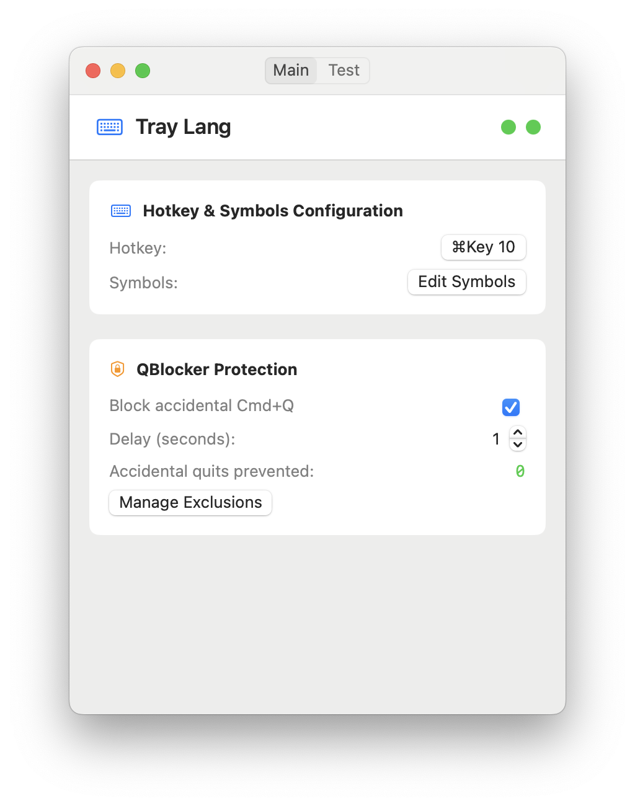

# Tray Lang

A macOS app that transforms text between keyboard layouts and prevents accidental app quits.



## What it does

**Text Transformation**: Select any text, press a hotkey, and it transforms between Russian/English layouts while switching your keyboard layout.

**QBlocker**: Prevents accidental Cmd+Q quits. Hold Cmd+Q for 1-5 seconds to actually quit an app.

## Quick Start

1. **Download & Run**: Build from source or download the app
2. **Grant Permissions**: Allow accessibility access when prompted
3. **Configure Hotkey**: Set your preferred key combination
4. **Use**: Select text → press hotkey → text transforms

## Features

### Text Transformation
- Transform text between Russian ↔ English layouts
- Customizable character mappings
- Automatic keyboard layout switching
- Works in any application

### QBlocker Protection
- Hold Cmd+Q for 1-5 seconds to quit apps
- Single press shows notification, prevents quit
- Exclude specific apps from protection
- Track prevented accidental quits

### Convenience
- System tray access
- Auto-launch with system
- Customizable hotkeys
- Visual feedback with HUD notifications

## Configuration

### Hotkey Setup
1. Open tray menu → "Hotkey Editor"
2. Press "Start capture" and your desired keys
3. Press "Confirm" to save

### QBlocker Settings
- **Enable/Disable**: Toggle in main window
- **Delay**: Set hold time (1-5 seconds)
- **Exclusions**: Manage apps that bypass protection

### Character Mappings
- Edit via tray menu → "Symbols Editor"
- Add custom character mappings
- Use ready-made language templates

## Requirements

- macOS 14.0+
- Accessibility permissions (for text manipulation)

## Installation

### From Source
```bash
git clone <repository>
cd tray-lang
make build
```

### Signing (if needed)
```bash
chmod +x /Applications/tray-lang.app
xattr -cr /Applications/tray-lang.app
codesign --force --deep --sign - /Applications/tray-lang.app
```

## Troubleshooting

**Hotkey not working?**
- Check accessibility permissions
- Try different key combination

**QBlocker not working?**
- Ensure it's enabled in main window
- Check accessibility permissions
- Verify app isn't in exclusion list

**Text not transforming?**
- Make sure text is selected
- Check character mappings
- Verify permissions

## Architecture

Built with SwiftUI and AppKit:
- `QBlockerManager`: Cmd+Q protection
- `ExclusionManager`: App exclusion handling
- `HotKeyManager`: Global hotkey management
- `TextTransformer`: Layout conversion logic

## License

© 2025 All rights reserved

## Developer

Developed by s00d
